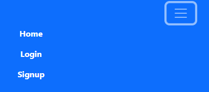

# Your Health Now

Your Health Now is a website aimed at users who wish to learn more about health and fitness, and who would like to be able to log their weight and run stats. I have also included the ability to track the user's weight using a chart to visualise the data. The user is able to sign up, log in and log out, and only the user's own stats will be available to them. The user is able to update their stats with the latest entry, edit any of their existing stats and delete any they wish to delete. The health history table will be updated as such with any additions or changes the user has made, making this a handy site to log and track your health stats.

## [Live Site](https://your-health-now.herokuapp.com/)

## Contents

- [Your Health Now](#your-health-now)
- [UX Design](#ux-design)
  - [Strategy Plane](#strategy-plane)
  - [Scope Plane](#scope-plane)
  - [Structure Plane](#structure-plane)
    - [User Stories](#user-stories)
  - [Skeleton Plane](#skeleton-plane)
    - [Site Flow](#site-flow)
  - [Surface Plane](#surface-plane)
    - [Colour Scheme](#colour-scheme)
- [Agile Development Process](#agile-development-process)
- [Current Features](#current-features)
  - [Base Features](#base-features)
    - [Title](#title)
    - [Navbar (Logged out)](#navbar-logged-out)
    - [Navbar (Logged in)](##navbar-logged-in)
    - [Footer](#footer)
  - [Home Page](#home-page)
    - [Main Section](#main-section)
    - [Article Section](#article-section)
  - [Login Page](#login-page)
  - [Signup Page](#signup-page)
  - [Article Page](#article-page)
  - [Health Hub](#health-hub)
    - [Update Stats](#update-stats)
    - [Health Hub History](#health-hub-history)
    - [Edit Stats](#edit-stats)
    - [Delete Stats](#delete-stats)
    - [Health Hub Tracker](#health-hub-tracker)
- [Future Development](#future-development)
- [Testing](#testing)
- [Deployment](#deployment)
- [Languages Used](#languages-used)
- [Technologies Used](#technologies-used)
- [Honourable Mentions](#honourable-mentions)
- [Credits](#credits)

## UX Design

### Strategy Plane
When creating a functional, informative website, a developer must consider all planes of development.

- Site Goal
	- The site goal is to allow users a space to both learn more about health and fitness, and allow users to track and visualise their weight and run stats.

- Target Audience
	- The target audience is those who are looking for a place to privately store and track their health stats and monitor their progress.

- User Requirements
	- The User must be able to learn more about health and fitness.
	- The User must be able to sign up and log in.
	- The User must be able to view, add to, edit and delete their stats.
	- The User must be able to log out.

### Scope Plane
Assessing the scope of a website is based on the information gathered from forumlating a strategy. Using the target audience and the established website goals, the website requirements were set out.
- Content Requirements:
	- Login Page
	- Logout Page
	- Sign up Page
	- Home Page
	- Article Page
	- Health Hub with the ability to add, edit delete and track health stats

### Structure Plane
The requirements listed above were then organised and structured into 3 areas, all of which the user can select from the nav bar:
- Home and Article sections
- Health Hub section (only available when logged in)
- Login/Signup section

#### User Stories
User Stories were then created to guide the development process. These are listed below and were logged as Issues, sorted into Milestones and completed on my project board in Github.

- As a user, I want to be able to edit and update an exercise planner for myself.
- As a user, I want to be able to update entries on the exercise planner when I have done them.
- As a user I want to be able to delete my stats.
- As a user I want to be able to view my stats over time.
- As a user I want to be able to see how my weight changes over time in graph format.
- As a user I want to be able to sign up to access the website’s features.
- As a user I want to be able to Log in to access my details privately.
- As a user I want to be able to logout to protect my data.
- As a user, I want to be able to learn about fitness and upcoming features.

I decided to remove the below user stories from my development using the agile process:
- As a user, I want to be able to comment on articles.
- As a user, I want to be able to delete my comments.
- As an admin, I want to be able to delete comments.

This decision was taken because I felt these features would not add much to the overall user experience. When faced with time limitations, I chose to implement the weight tracker over the commenting functionality because it was more conducive to the overall goal of the website.

### Skeleton Plane
A wireframe for the website was produced using a desktop version of Balsamiq in order to provide a clear image of what the website should look like.

#### Site Flow
Using Balsamiq, I then created a flow map showing what I would visualise as the user's journey through the website.

### Surface Plane

#### Colour Scheme
I decided to use a simplistic blue, white and grey colour scheme. I chose this because the contrast between white and grey allows for easy contrast and an accessible site. I chose blue for the header and buttons in homage to the NHS (National Health Service) in England, an institution dedicated to healthcare for all, which my website aspires to.

## Agile Development Process
I used Github's issues functionality, and organised them into milestones, which can be found [here](https://github.com/BenD2525/Your-Health-Now/milestones). I also organised my issues using my project board, found [here](https://github.com/users/BenD2525/projects/2), moving them between in progress and completed as and when. During the development process I decided to implement user signup functionality as a priority, before then implementing CRUD functionality, articles to the home page, and the weight tracker.

## **Current Features**

### Base Features
The below features are part of my base template, and as such are included on all pages.

#### **Title**
The title of the website, I used the bootstrap display class to clearly display this as the website's title, ensuring it is prominent on each page.

#### **Navbar (Logged Out)**
When accessing the site on the desktop, the navbar is located next to the title, following the blue and white scheme.

On a mobile view, this is changed to a burger menu.

#### **Navbar (Logged In)**
When logged in as a user on the desktop, the navbar is located next to the title, following the blue and white scheme.
When logged in, the login function changes to logout, and the sign up link is removed and replaced with 'My Health' which allows access to the health hub.

On a mobile view, this is changed to a burger menu.

#### **Footer**
The footer is located at the bottom of the page. It is fixed there so is always visible to the user wherever they are on the page. It features my name, alongside a Github icon which allows the user to navigate to my Github to view other projects. On the opposite side of the footer, I have included a link to the top of the page the user is on, which allows for easy navigation on the longer pages on mobile view.

### **Home Page**
The home page is the landing page for the website, and serves to tell the user what the website is about. It includes the main section, which explains the purpose of the site, underneath a large image of a person running, which introduces the theme of health. Underneath this, there are the articles which have been loaded into the Articles model. Whenever a new article is added, it will automatically display the title, featured image and topic which is taken from the Articles model. The admin user has the ability to add a new article.

#### **Main Section**
The main section consists of a large welcome image and the purpose of the website underneath it.

#### **Article Section**
The article section shows the user an introduction to each article that is available to read, alongside a link to the article and the article's featured image.

### **Login Page**
The login page features a login form using AllAuth and formatted with the crispy forms package.

Once the user logs in, they are redirected to the home page and a successful message shows.

### **Signup Page**
The Signup page features a signup form using AllAuth and formatted with the crispy forms package.

### **Article Page**
The Article Detail page allows the user to learn more about health and fitness. Once the user clicks 'read more' next to one of the articles on the homepage, they are directed here and are able to read the entire article, and go back to the home page.

### **Health Hub**
The Health Hub page is specific to the logged in user, and only available once the user is logged in. It includes the details of their latest stats entry displayed in table format. This data is brought through from the health stats model, and if there are no entries, the table will read blank. Below the table are buttons to take the user to the other parts of the Health Hub, or back to the home page. 

#### **Update Stats**
The update stats form allows the user to add a new instance into the Health Stats model. The User and Date instances are automatically collected and stored, and the user is asked to provide the other stats. It requires all fields to be filled out, and in the formats described on the field labels. Once the form is submitted, the user is redirected to the health hub.

#### **Health Hub History**
The Health History page shows the user all of their logged data, displayed in table format with the most recent one at the top. On a mobile view, I added a horizontal scroll function to the table, in order to allow the user to view all of their data easily. The table has buttons to allows the user to edit and delete each entry in the final two columns. These are colour coded to emphasise the functionality- red for delete and blue for edit.
If the user has logged stats, the button for the weight track will also show to enable the user to track their weight.

#### **Edit Stats**
If the user clicks the edit button on an entry on the health history table, they are presented with a form, with the current values of that entry already filled out. The user is then able to edit the details they wish and and update the entry. Once the form is submitted, the user is redirected to the health history page.

#### **Delete Stats**
If the user clicks the delete button on an entry on the health history table, they are presented with a warning message asking the user to confirm they are happy to delete this entry. The user can confirm, or go back to the previous page. If the user confirms, the entry is deleted and they are redirected to the health history page (minus the deleted entry).

#### **Health Hub Tracker**
The Health Hub Tracker page allows the user to track their weight stats over time in the form of a line graph. The Y axis displays the user's weight stats and the X axis displays the dates that these stats were registered. The date information is automatically gathered whenever the user submits a new entry using the Update Stats form. This provides some basic data visualisation for the user, and is an area which could be further developed to enable a wider variety of tracking options.

## **Future Development**

### Chart Variation
The ability to have multiple different chart types for different stats, and being able to change them in realtime would be a feature to develop in future.

### Stat Choice
The ability for the user to choose which stats to log and track. This would require multiple forms and the logic to choose between them.

### Workout Planner
A workout planner held within the Health Hub which would allow the user to plan their workouts on a calendar, tick them off and register the stats from them. 

## Testing
Details of all testing undertaken can be found .

## Deployment

This project was deployed to Heroku after being developed in the GitPod environment.

Steps to deploy:

- For the live project, ensure that DEBUG = False in settings.py.
- Go to your Heroku project dashboard, and click on the 'Deploy' tab.
- Click on the Github icon 'connect to GitHub'.
- Login to your GitHub account if needed, then search for the repository you want to connect the site to.
- When it shows up below, click 'connect'.
- Next to 'Automatic deploys' choose the branch you'd like to deploy from. In most cases this will be 'main'.
- Click 'Enable Automatic Deploys' if you would like Heroku to deploy your code everytime you push it to the above branch.
- If you prefer to deploy manually, scroll down to 'Manual deploy', choose your branch, and click 'Deploy Branch'.
- Scroll back to the top, and once it's finished deploying, click 'Open app', on the top right side.

## **Languages used**
- Python
- HTML
- CSS
- Javascript

## **Technologies used**
- Django
- Django AllAuth
- Bootstrap
- Crispy Forms
- Cloudinary (for image hosting)
- Balsamiq
- Unsplash (for images)
- Chart.js
- PostGreSQL

## Honourable Mentions
- Tom Ainsworth for the Readme structure, thanks so much!
- Christian Brown for helping me set up Cloudinary
- Slack
- Stack Overflow
- Daisy Gunn for helping me figure out why signup emails weren't sending
- CI London Community for general support when traversing the Django learning curve!

## Credits
- [Balsamiq](https://balsamiq.com/) for creating the wireframes
- VS Code for the text editor
- [Bootstrap](https://getbootstrap.com/docs/5.0/getting-started/introduction/)
  - Version 5.1.3, CSS framework for building a responsive front end.
- [Cloudinary](https://cloudinary.com/)
  - Used to store static files and media.
- [GitHub](https://github.com/)
  - Used for version control throughout the build process
  - GitHub Projects used to organise user stories and tasks.
  - Milestones were used to group user stories into sections.
- [Google Fonts](https://fonts.google.com/)
- Cripsy Forms for formatting all of my forms.
- General References
  - Stack Overflow
  - GeeksForGeeks
  - Django docs
  - Bootstrap Docs
  - W3Schools
  - Chart.js docs
- [Unsplash](https://unsplash.com/) for providing the images, specifically:
  - Brian Erickson for the home page image
  - Jenny Hill for the running article image
  - Jose Vazquez for the yoga article image
  - Sushil Ghimire for the Weightlifting article image