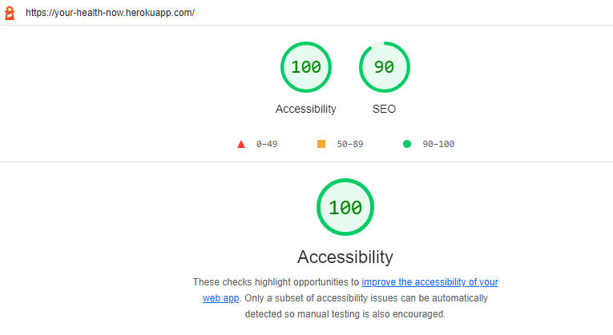
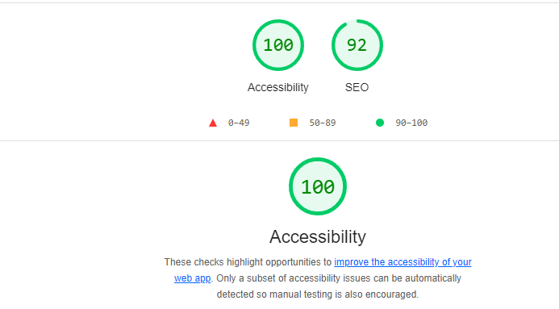
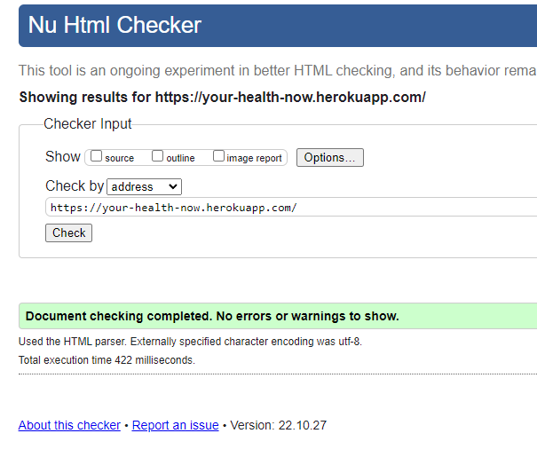
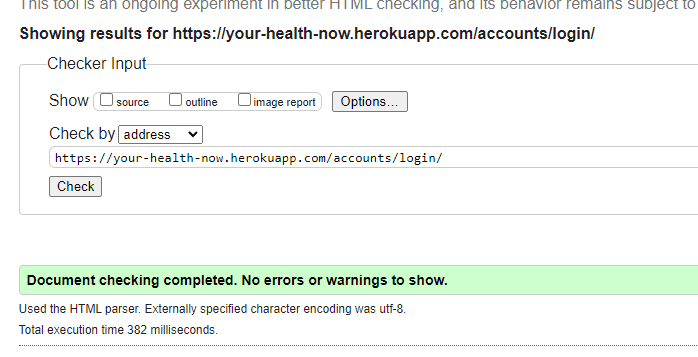
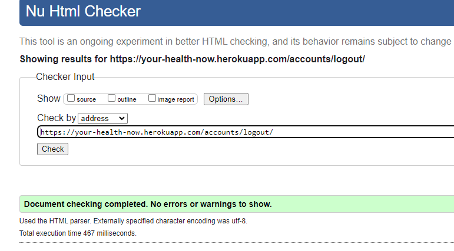
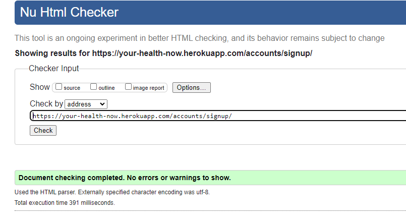
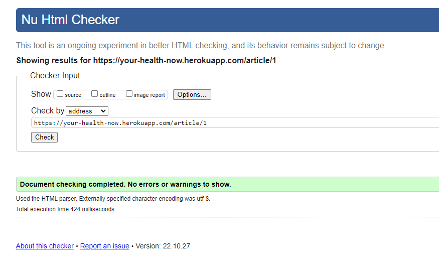
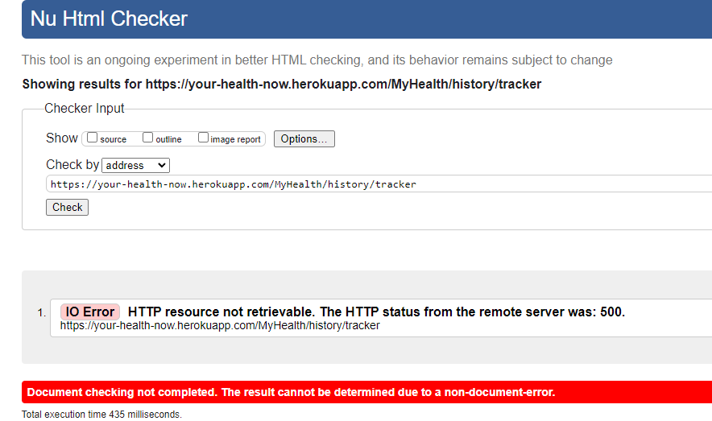
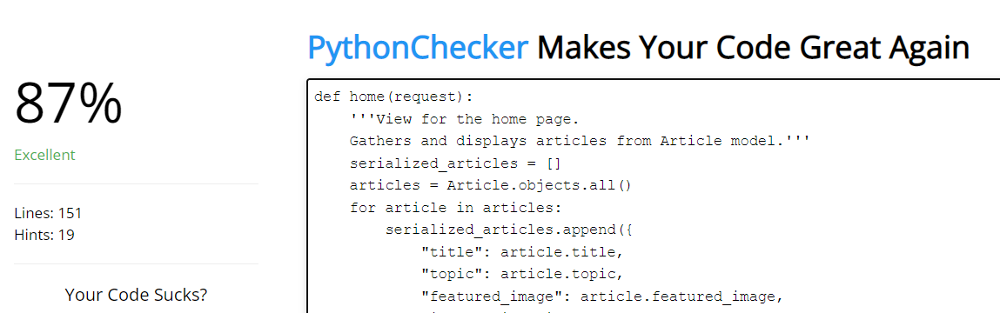

# Testing

[Return to README.md](README.md)

- [Bugs and Fixes During the Development Process](#bugs-and-fixes-during-the-development-process)
- [Wave Aim Accessibility checker:](#wave-aim-accessibility-checker)
- [Lighthouse](#lighthouse)
  - [Mobile](#mobile)
  - [Desktop](#desktop)
- [Validators](#validators)
  - [HTML](#html)
  - [CSS](#css)
  - [Javascript](#javascript)
  - [Python](#python)
- [User Stories](#user-stories)

## Bugs and Fixes During the Development Process
- Messages
    - Issue - Messages were not being removed automatically.
    - Cause - The messages were set to display, but not set to close without user intervention.
    - Solution - I added a timeout script to the base file which would close the message after 3 seconds.
- Images
    - Issue - Images weren't displaying.
    - Cause - The links for the images were not correct, and so were unable to display anything from Cloudinary.
    - Solution - I changed the image links to cloudinary urls.
- Weight Tracker
    - Issue - Data wasn't pulling through to the chart on the weight tracker.
    - Cause - I hadn't converted the weight stats to an integer or the dates to strings.
    - Solution - I added an integer specifier to my health tracker view for my serialized weight list and a string specifier for my serialized date list.
- Delete Entry
    - Issue - Original deletion functionality wasn't working when I had modals set up to pop up when the user clicked the delete button. Whichever delete button was used, the same data was deleted.
    - Cause - The modal IDs were conflicting with the entry IDs, so it was deleting the same entry each time.
    - Solution - I changed approach from using modals to delete to using a DeleteView from django's generic views.
- SEO
    - Issue - SEO score was quite low.
    - Cause - I had forgotten the description, author and keywords information for the meta tag and SEO's weren't picking up 'read more' on my article links.
    - Solution - I added this information in to the meta tag and amended the links to read 'learn more'.
- Emails
    - Issue - Emails were not sending outside of the development environment.
    - Cause - I had not configured my config vars on Heroku to include my EMAIL_HOST_USER and EMAIL_HOST_PASSWORD variables.
    - Solution - I added these into Heroku and the emails began sending and the error message stopped showing.
- Health Hub
    - Issue - The data in the table was showing the most recent data by date only. If the user had added multiple stats on the same day, it would only display the first set of stats on that day. It should have shown the most recent set of stats in time.
    - Cause - The date field was set up as a datefield in the healthstats model.
    - Solution - The date field was changed to a datetime field instead, this fixed the issue.

## Accessibility

## Lighthouse

### Desktop

When I first tested, my SEO score was quite low. I found that this was because I had forgotten the description, author and keywords information for the meta tag. To fix this, I added this information in to the meta tag and as a result, my score improved to 90%. The only issue currently still highlighted is the wording used for my links on the home page. They are flagged as not descriptive of the links, however I feel amending them to 'click here' as suggested, would change the feel of the site and be less descriptive so I have decided to keep them as they are.

### Mobile

The only detractor on the mobile view is the same as on the desktop view- the wording for the links, which have not been amended as explained above.

## Browser Compatability

Google Chrome, Microsoft Edge, Mozilla Firefox and Safari all display content and images correctly and all links work and open in new window.
This was tested on a laptop, PC, iPad, Iphone SE, Galaxy S8 and a Motorola G9.

## Validators

### HTML

No errors were found, apart from an IO error found on the Health Hub pages. After looking up the error message, this is down to the HTML validator.

### CSS

No errors or warnings were found for my custom CSS.

### JavaScript

There are 2 scripts in my files, one located in base.html which is my function for setting the timeout of messages. The other is my chart.js script which was based on the example provided in the chart.js [documentation](https://www.chartjs.org/docs/latest/).

When posting each script into the [javascript validator](https://jsvalidator.com/)- the only errors found were as a consequence of using django's template language.

### Python

[Python Checker](https://www.pythonchecker.com) was used to test all python files. All efforts were made to make all code pep8 compliant, with the exception of the settings.py file, which Django state in their docs is okay to ignore should it make the code uglier or harder to read.

## User Stories

### As a user, I want to be able to learn about health and fitness.
- On the home page the user can read articles about health and fitness. Whenever the admin adds a new article, this will automatically be updated on the home page.

### As a user I want to be able to sign up to access the website’s features.
- There is signup functionality clearly shown from the navbar, and the user is able to create a user account using their email to confirm.

### As a user I want to be able to Log in to access my details privately.
- There is login functionality clearly shown from the navbar, and will allow a previously signed up user to log in as themselves. This provides access to the health hub section of the website, where the user can track their health stats.

### As a user I want to be able to logout to protect my data.
- There is logout functionality clearly shown from the navbar when the user is logged in. If the user has not logged in, this will not show as an option.

### As a user I want to be able to view my stats.
- Once the user has logged in, they can access the health hub section using 'My Health' from the navbar. From here, they are shown their most recent stats and have the ability to view all of their stats within a table.

### As a user I want to be able to edit my stats.
- When viewing their stats history in table format, the user is able to click the 'edit' button next to the stat they wish to edit. They are then presented with a form, in which they can change any of the stats that they wish. Once they confirm, the entry will be edited and they will be redirected.

### As a user I want to be able to delete my stats.
- When viewing their stats history in table format, the user is able to click the 'delete' button next to the stat they wish to delete. They are then taken to another screen asking the user to confirm that they are happy to delete this entry. Once they confirm, the entry will be deleted and they will be redirected.

### As a user I want to be able to see how my weight changes over time in graph format.
- The user can access and see their weight stats on a tracker using the weight tracker page. This allows the user to track their weight over time, with the weight being shown in the form of a line graph. Along the bottom, the dates of each weight entry are registered.

[Return to README.md](README.md)